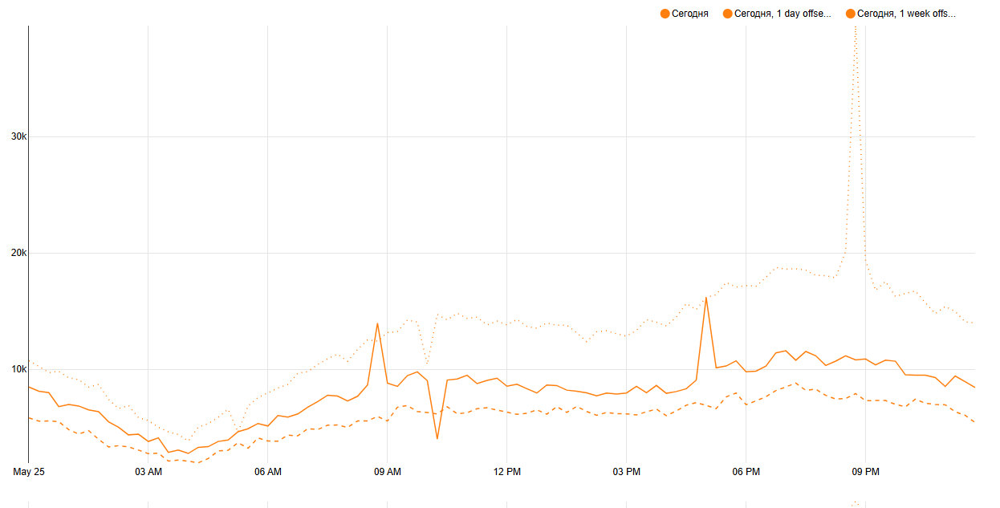
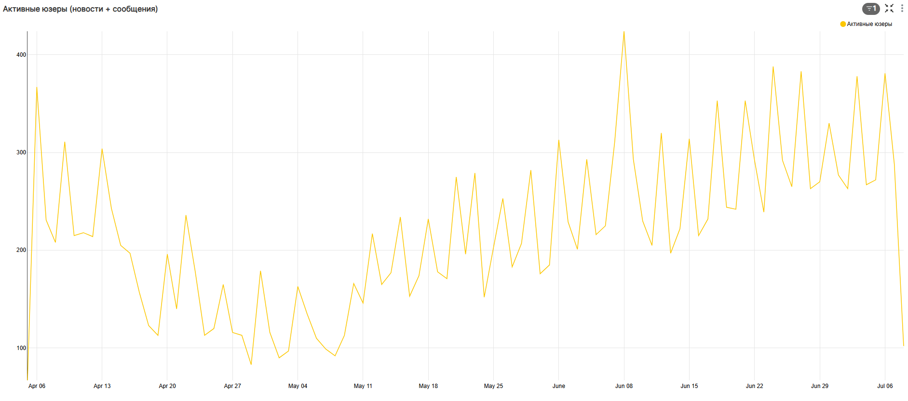

# Пример запроса в базу данных feed_actions с помощью redash


# Пример запроса в базу данных message_actions с помощью redash


# график DAU (daily active users)
```sql
SELECT toStartOfDay(toDateTime(time)) AS __timestamp,
       count(DISTINCT user_id) AS "Уникальные пользователи"
FROM simulator_20250520.feed_actions
GROUP BY toStartOfDay(toDateTime(time))
ORDER BY "Уникальные пользователи" DESC
```


на графике видно что количество уникальных пользователей со временем растет, это хорошо!

# Динамика DAU по 15-минутным интервалам за день с сравнением предыдущих периодов
Для сравнения приведены данные за аналогичное время дня назад и неделю назад.

### Ключевые наблюдения:
* **Пик активности**:
На графике виден пик активности пользователей примерно в **9:00 PM** , когда количество DAU достигает максимального значения (~20k). Это может быть связано с тем, что вечернее время — наиболее удобное для взаимодействия с новостной лентой.
* **Низкая активность ночью:**
В ночное время (например, между 12:00 AM и 6:00 AM ) активность минимальна, что соответствует естественному циклу сна пользователей.
* **Сравнение с предыдущими периодами:**
       * **День назад:** Данные за предыдущий день демонстрируют схожую динамику, но уровень активности немного ниже. Это может указывать на ежедневную стабильность использования продукта.
       * **Неделя назад:** Активность за неделю назад также имеет схожий паттерн, но уровни DAU могут отличаться из-за сезонных факторов или изменений в продукте.
* **Тренды:**

  * **Утром** (около 7:00 AM–9:00 AM ) наблюдается небольшой рост активности, вероятно, связанный с началом рабочего дня.
  
  * **После обеда** (12:00 PM–1:00 PM ) активность снижается, возможно, из-за перерыва на обед или других деловых обязанностей.

# график WAU (week active users)
```sql
SELECT toMonday(toDateTime(time)) AS __timestamp,
       count(DISTINCT user_id) AS "Уникальные пользователи"
FROM simulator_20250520.feed_actions
GROUP BY toMonday(toDateTime(time))
ORDER BY "Уникальные пользователи" DESC
```


# График Лайков и просмотров
```sql
SELECT toStartOfDay(toDateTime(time)) AS __timestamp,
       action AS action,
       count(user_id) AS "События"
FROM simulator_20250520.feed_actions
GROUP BY action,
         toStartOfDay(toDateTime(time))
ORDER BY "События" DESC
```


На графике отображена динамика лайков и просмотров за период с апреля по июль. В целом можно отметить следующее:

1. **Просмотры (view):**  
   Количество просмотров демонстрирует стабильный рост с апреля по июль, хотя наблюдается высокая волатильность. Особенно заметен значительный пик в середине мая, когда число просмотров достигает **1.2 млн**, после чего происходит снижение до уровня около **600–800 тыс.**

2. **Лайки (like):**  
   Количество лайков значительно ниже, чем просмотров, и также демонстрирует рост, но менее выраженный. Лайки остаются на уровне **200–300 тыс.** в течение всего периода.

3. **Ключевые моменты:**
   - **Пик просмотров в середине мая:** Возможно связан с публикацией популярного контента или рекламной кампанией.
   - **Снижение просмотров после пика:** Эффект от пикового события ослабевает со временем.
   - **Стабильное отношение лайков к просмотрам:** Пропорция между лайками и просмотрами остается относительно постоянной (~20–25%).

# График вовлеченности пользователей (CTR = like/view)
```sql
SELECT toStartOfDay(toDateTime(time)) AS __timestamp,
       countIf(user_id, action='like') / countIf(user_id, action='view') AS "CTR"
FROM simulator_20250520.feed_actions
GROUP BY toStartOfDay(toDateTime(time))
ORDER BY "CTR" DESC
```


На графике отображена динамика CTR за период с апреля по июль. В целом можно отметить следующее:

1. **Начальный период (апрель–начало мая):**  
   CTR стабильно находился на уровне около **0.205**, что указывает на относительно стабильную вовлеченность пользователей.

2. **Рост в середине мая:**  
   Наблюдается значительный рост CTR до **0.22**, вероятно, связанный с изменениями контента или маркетинговыми кампаниями.

3. **Волатильность в июне:**  
   В июне CTR демонстрирует высокую нестабильность с частыми пиками и спадами. Это может быть связано с:
   - Нестабильностью качества контента.
   - Изменениями в поведении пользователей.
   - Влиянием рекламных кампаний или A/B-тестов.

4. **Новый пик в июле:**  
   В конце июля CTR достигает нового максимума (**0.225**) перед небольшим снижением. Этот рост может быть связан с новыми инициативами или изменениями в продукте.

# Таблица самых популярных постов
```sql
SELECT post_id AS post_id,
       countIf(action='view') AS "Просмотры",
       countIf(action='like') AS "Лайки",
       countIf(action='like') / countIf(action='view') AS "CTR",
       count(DISTINCT user_id) AS "Охват"
FROM simulator_20250520.feed_actions
GROUP BY post_id
ORDER BY "Просмотры" DESC
```


# Таблица анализа пользователей по возростам
```sql
SELECT age AS age,
       count(age) AS "Пользователи"
FROM simulator_20250520.feed_actions
GROUP BY age
ORDER BY "COUNT(age)" DESC
```


# Таблица самых распространненных городов пользователей
```sql
SELECT city ,
       count(user_id) AS "Пользователи"
FROM simulator_20250520.feed_actions
GROUP BY city
ORDER BY "COUNT(user_id)" DESC
```


# График активных пользователей (те, кто использует и новостную ленту, и мессенджер)
```sql
SELECT toStartOfDay(toDateTime(date)) AS __timestamp,
       sum(active_users) AS "Активные юзеры"
FROM
  (SELECT date, COUNT(DISTINCT user_id) AS active_users
   FROM
     (SELECT user_id,
             DATE(time) AS date
      FROM simulator_20250520.feed_actions INTERSECT SELECT user_id,
                                                            DATE(time) AS date
      FROM simulator_20250520.message_actions) AS common_users
   GROUP BY date
   ORDER BY date) AS virtual_table
GROUP BY toStartOfDay(toDateTime(date))
ORDER BY "Активные юзеры" DESC
```


# Тепловая карта удержания пользователей (retenshen)
```sql
SELECT toString(start_day) start_day,
       toString(day) day,
                     count(user_id) AS users
FROM
  (SELECT *
   FROM
     (SELECT user_id,
             min(toDate(time)) AS start_day
      FROM simulator_20250520.feed_actions
      GROUP BY user_id) t1
   JOIN
     (SELECT DISTINCT user_id,
                      toDate(time) AS day
      FROM simulator_20250520.feed_actions) t2 USING user_id
   WHERE start_day >= today() - 20 )
GROUP BY start_day,
         day
```


# График активных пользователей в разрезе старых, новых и ушедших
```sql
SELECT this_week, previous_week, -uniq(user_id) as num_users, status FROM

(SELECT user_id, 
groupUniqArray(toMonday(toDate(time))) as weeks_visited, 
addWeeks(arrayJoin(weeks_visited), +1) this_week, 
if(has(weeks_visited, this_week) = 1, 'retained', 'gone') as status, 
addWeeks(this_week, -1) as previous_week
FROM simulator.feed_actions
group by user_id)

where status = 'gone'

group by this_week, previous_week, status

HAVING this_week != addWeeks(toMonday(today()), +1)

union all


SELECT this_week, previous_week, toInt64(uniq(user_id)) as num_users, status FROM

(SELECT user_id, 
groupUniqArray(toMonday(toDate(time))) as weeks_visited, 
arrayJoin(weeks_visited) this_week, 
if(has(weeks_visited, addWeeks(this_week, -1)) = 1, 'retained', 'new') as status, 
addWeeks(this_week, -1) as previous_week
FROM simulator.feed_actions
group by user_id)

group by this_week, previous_week, status
```

На графике представлена динамика активной аудитории по неделям.
Для каждой недели пользователи разделены на три категории:

* **Новые** — те, у кого это была первая активность в новостной ленте.
* **Старые** — пользователи, которые были активны как в текущую, так и в предыдущую неделю.
* **Ушедшие** — те, кто был активен на прошлой неделе, но не заходил в приложение на текущей неделе.


